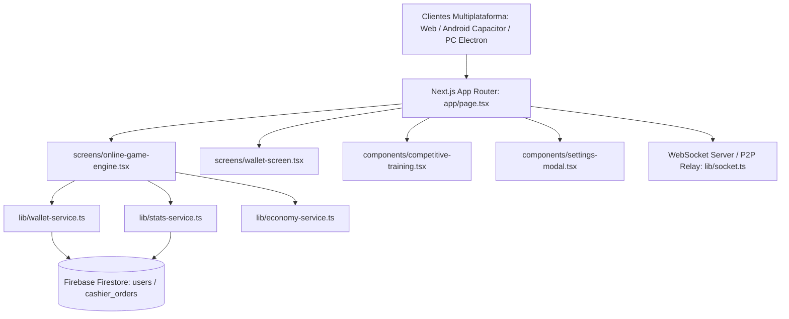
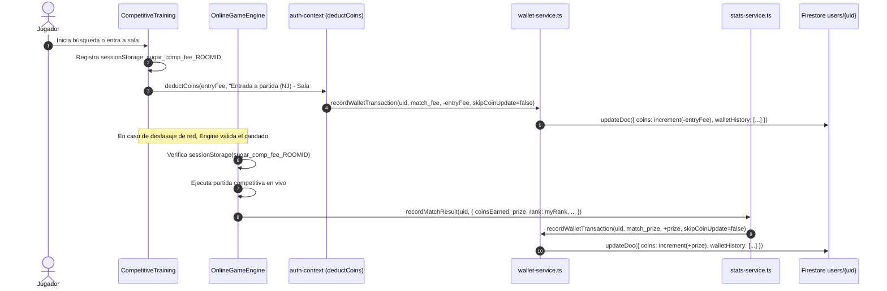

# 📘 SUGAR LUDO — ARCHIVO MAESTRO DE HANDOFF Y MEMORIA TÉCNICA
**Versión Oficial de Producción:** `v9.5.4`  
**Commit de Producción en `origin/main`:** `39264d7`  
**Fecha de Emisión:** 22 de Septiembre de 2026  
**Propósito:** Documento de inducción técnica, auditoría arquitectónica y transferencia de contexto integral para la continuidad operativa del monorepo sin pérdida de memoria de ingeniería.

---

## 🏛️ 1. VISIÓN ARQUITECTÓNICA Y MAPA DEL MONOREPO

Sugar Ludo es una plataforma iGaming y Fintech multijugador en tiempo real basada en **Next.js 16+ (App Router con Turbopack)**, empaquetada como cliente híbrido multiplataforma para la Web, **Android (Capacitor)** y **Desktop PC Windows (Electron)**, operando bajo una infraestructura de **Costo Cero Absoluto ($0.00/mes)** en el Plan Spark de Firebase y Render.



### 📂 Estructura Detallada de Módulos y Responsabilidades

| Directorio / Archivo | Rol en la Arquitectura | Responsabilidad Técnica |
| :--- | :--- | :--- |
| `app/page.tsx` | Orquestador Principal | Controlador de pantallas activas (`lobby`, `training`, `online-training`, `competitive`, `online-game`, `game`, `tienda`, `billetera`, `amigos`, `eventos`, `correo`, `coleccion`), listeners globales de socket (`match_found`), control de modales y enrutamiento reactivo. |
| `screens/online-game-engine.tsx` | Motor Multijugador en Vivo | Motor de juego autoritativo para 2 a 6 jugadores (tableros cuadrado y hexagonal). Gestiona turnos (15s estricto), sincronización de fichas, sala de voz WebRTC, **cobro idempotente de entrada** y **liquidación del podio**. |
| `screens/wallet-screen.tsx` | Billetera y Cajero P2P | Visualización de saldo en Sugar Coins (SC) y equivalencia en USDT (1 USDT = 100 SC), solicitud de depósitos/retiros, historial de transacciones (`walletHistory`) y control de custodia (Escrow). |
| `components/competitive-training.tsx` | Lobby de Partidas Competitivas | Selección de jugadores (2 a 6), matchmaking rápido, creación y unión a salas privadas mediante código, cálculo de tarifas de entrada según la matriz económica y cobro diferido. |
| `components/settings-modal.tsx` | Ajustes y Diagnóstico | Control de audio, vibración, tema, cierre de sesión, enlaces al Centro de Descargas y **exportación universal de logs con soporte nativo para Android y PC**. |
| `lib/wallet-service.ts` | Ledger Financiero Atómico | Mutaciones atómicas de saldo con `increment(tx.amount)`, inserción inmutable en `walletHistory` (límite de 50 registros) y gestión de órdenes P2P de cajeros. |
| `lib/stats-service.ts` | Estadísticas y Premios | Registro de partidas (`recordMatchResult`), cálculo de XP, niveles, rachas de victorias y acreditación de premios de podio (`match_prize`). |
| `lib/auth-context.tsx` | Contexto de Autenticación | Manejo de sesión con Google OAuth, autenticación nativa en Electron vía Deep Linking (`sugarludo://auth`), modo desarrollador (`isDev`), y función unificada de débito atómico `deductCoins`. |
| `lib/economy-service.ts` | Matriz Económica y Comisiones | Configuración de entradas, pozos y premios para partidas de 2 a 6 jugadores (`DEFAULT_ECONOMY_MATRIX`), paquetes de monedas y tarifas de retiro (5% Normal / 10% VIP). |
| `lib/constants.ts` & `lib/version.ts` | Constantes y Versión | Versión oficial (`v9.5.4`), URLs de descarga en GitHub Releases y dominio de la Landing Page. |
| `sugar-ludo-landing/` | Landing Page Oficial | Aplicación Next.js independiente desplegada en Render (`https://sugar-ludo-landing.onrender.com`), con enlaces de descarga directa hacia GitHub Releases. |
| `android/` | Contenedor Nativo Android | Proyecto nativo de Capacitor sincronizado mediante `npx cap sync android` y compilado mediante `./gradlew assembleDebug`. |
| `dist/` | Salida de Binarios | Binarios finales para distribución: `SugarLudo-v9.5.4-Setup.exe` (PC) y `SugarLudo-v9.5.4.apk` (Android). |

### 🚀 Topología de Despliegue y Distribución

1. **Juego Web Oficial:** Alojado en Render (`https://sugar-ludo-web.onrender.com`).
2. **Landing Page & Portal:** Alojado en Render (`https://sugar-ludo-landing.onrender.com`).
3. **Binarios Oficiales:** Distribuidos a través de **GitHub Releases** bajo la etiqueta `v9.5.4` en el repositorio `carlox7800/sugar_ludo_web`.

---

## 🔒 2. AUDITORÍA ZERO-TRUST Y SEGURIDAD DE DATOS

### 🛡️ Reglas de Seguridad de Firestore (`firestore.rules`) — INTOCABLES
El archivo `firestore.rules` fue blindado y auditado formalmente para garantizar **Costo $0.00 en Spark** e impedir ataques de inyección o sobreescritura maliciosa de saldos. **Queda estrictamente prohibido alterar este archivo.**

#### Puntos Críticos del Blindaje:
1. **Protección de Roles y Estados Administrativos:**
   ```firestore
   match /users/{userId} {
     allow read: if true;
     allow create: if request.auth != null && request.auth.uid == userId && 
                   (!('coins' in request.resource.data) || request.resource.data.coins <= 200);
     allow update: if (request.auth != null && request.auth.uid == userId &&
                       !request.resource.data.diff(resource.data).affectedKeys()
                         .hasAny(['role', 'isBanned', 'isFrozen'])) ||
                      (request.resource.data.diff(resource.data).affectedKeys()
                         .hasAny([
                           'coins', 'escrowLockedCoins', 'walletHistory', 'lastActiveAt', 
                           'inbox', 'lastSettledDepositId', 'lastSettledWithdrawalId', 
                           'payoutTxId', 'unreadMailCount', 'unreadMessages', 'playerReadAt'
                         ]));
     allow delete: if false;
   }
   ```
   - Ningún usuario puede autoasignarse roles administrativos (`role`) ni desbloquearse si ha sido sancionado (`isBanned`, `isFrozen`).
   - Las mutaciones de `coins`, `escrowLockedCoins` y `walletHistory` solo son permitidas bajo el UID autenticado correspondiente.

2. **Inmutabilidad y Atomicidad del Ledger Financiero:**
   - Cada transacción genera un registro único con `timestamp`, `id`, `type`, `amount` y `description`.
   - `walletHistory` mantiene exclusivamente los últimos 50 movimientos (`history.slice(0, 50)`), evitando que el documento del usuario crezca indefinidamente y supere los límites de tamaño de Firestore (1 MB por documento).

---

## 💰 3. RESTAURACIÓN CONTABLE Y ECONOMÍA MULTIJUGADOR (2 A 6 JUGADORES)

### ⚙️ Circuito Contable Corregido en v9.5.4



### 📐 Matriz Económica Oficial y Principio de Conservación de Valor

La economía de partidas se rige por la ecuación de solvencia:
$$\text{Pozo Total} = \sum \text{Premios Jugadores} + \text{Rake Plataforma}$$

| Jugadores | Entrada (SC) | Pozo Total (SC) | Distribución de Premios (SC) | Rake Casa (SC) | % Rake Efectivo |
| :---: | :---: | :---: | :---: | :---: | :---: |
| **2 Jugadores** | 100 SC | 200 SC | 1.º: 150 SC | 50 SC | 25.0% |
| **3 Jugadores** | 120 SC | 360 SC | 1.º: 200 SC \| 2.º: 80 SC | 80 SC | 22.2% |
| **4 Jugadores** | 150 SC | 600 SC | 1.º: 300 SC \| 2.º: 150 SC | 150 SC | 25.0% |
| **5 Jugadores** | 200 SC | 1000 SC | 1.º: 400 SC \| 2.º: 200 SC \| 3.º: 100 SC | 300 SC | 30.0% |
| **6 Jugadores** | 300 SC | 1800 SC | 1.º: 600 SC \| 2.º: 450 SC \| 3.º: 250 SC \| 4.º: 100 SC | 400 SC | 22.2% |

### 🔐 Candado de Idempotencia de Doble Barrera (`sugar_comp_fee_${roomId}`)
Para erradicar dobles cobros o partidas gratuitas provocadas por reconexiones de socket o re-renders de React:
1. **Barrera 1 (Lobby - `competitive-training.tsx`):** Al detectar `match_found`, se almacena inmediatamente `sessionStorage.setItem('sugar_comp_fee_' + roomId, 'true')` y se invoca `deductCoins`.
2. **Barrera 2 (Arena - `screens/online-game-engine.tsx`):** Al montar el tablero en `modeType === 'competitive'`, se inspecciona `sessionStorage.getItem('sugar_comp_fee_' + roomId)`. Si ya existe, se omite el cobro; si el lobby fue desmontado prematuramente por la navegación global de Next.js, la arena ejecuta el cobro de forma segura y marca la bandera.
3. **Preservación de Origen en `app/page.tsx`:** `handleGlobalMatchFound` evalúa explícitamente `currentScreen === 'competitive' ? 'competitive' : ...` para que la mesa reciba invariablemente `modeType="competitive"`.

---

## 📱 4. DISTRIBUCIÓN, PLATAFORMAS Y EXPORTACIÓN DE LOGS

### 🖥️ Windows PC (Instalador NSIS Personalizado)
En `package.json`, la sección `nsis` está configurada para brindar una experiencia de usuario interactiva y profesional:
```json
"nsis": {
  "oneClick": false,
  "allowToChangeInstallationDirectory": true,
  "perMachine": false,
  "createDesktopShortcut": true,
  "createStartMenuShortcut": true,
  "shortcutName": "Sugar Ludo",
  "uninstallDisplayName": "Sugar Ludo v${version}",
  "artifactName": "SugarLudo-v${version}-Setup.${ext}"
}
```
- Permite seleccionar la carpeta de destino deseada.
- Despliega el nombre oficial del producto y la versión (`Sugar Ludo v9.5.4`).

### 📱 Android (Capacitor & Web Share API)
- **Problema histórico:** Los WebViews de Android bloquean silenciosamente las URLs sintéticas `blob:` en enlaces con atributo `download`, dejando inoperante la exportación tradicional.
- **Solución implementada en `components/settings-modal.tsx`:**
  ```typescript
  if (isCapacitorNative && typeof navigator !== 'undefined' && navigator.share) {
    const file = new File([fullContent], fileName, { type: 'text/plain' })
    if (navigator.canShare && navigator.canShare({ files: [file] })) {
      await navigator.share({
        files: [file],
        title: 'Sugar Ludo - Logs de Diagnóstico',
        text: 'Registro de diagnóstico y telemetría de Sugar Ludo'
      })
      return
    }
  }
  ```
  Abre la hoja nativa de Android ("Compartir", "Guardar en Archivos", "Google Drive", etc.).
- **Fallback universal:** Si el usuario está en PC o navegador web, se ejecuta la descarga directa del archivo `.txt`. Si la Web Share API no está disponible, se copia silenciosamente al portapapeles con `copyToClipboardSilently(fullContent)`.

### 🌐 Descarga de APK en la Landing Page
- En `sugar-ludo-landing`, los botones de descarga de Android utilizan redirección directa hacia el APK oficial alojado en GitHub Releases, prescindiendo del atributo `download` para evitar bloqueos por políticas de descargas mixtas en navegadores móviles.

### 📦 Empaquetado y Publicación en GitHub Releases
Al generar los paquetes para una nueva release:
- **Archivo EXE:** `dist/SugarLudo-v9.5.4-Setup.exe` (~230 MB).
- **Archivo APK:** `dist/SugarLudo-v9.5.4.apk` (~50.2 MB).
- **Descarte de Metadatos:** El archivo `*.blockmap` generado por Electron Builder es exclusivo para actualizaciones diferenciales de auto-updater y **debe ser descartado** al subir los archivos a GitHub Releases.

---

## 📊 5. MÉTRICAS DE CALIDAD, ESTADO DE GIT Y TESTS

### 🧪 Suite de Pruebas Automatizadas (`npm test`)
Ejecutada mediante el runner nativo de Node.js (`node --experimental-strip-types --test tests/**/*.test.ts`).

```
ℹ tests 53
ℹ suites 12
ℹ pass 53
ℹ fail 0
ℹ cancelled 0
ℹ duration_ms ~1250ms (100% verde)
```

#### Cobertura de las Suites de Prueba:
1. `cleanFirestorePayload & Normalización de Payloads` (4 tests)
2. `Matemática Financiera y Comisiones de Retiro` (5 tests)
3. `Validación de Payloads de Cuentas de Pago (Cripto vs. Bancarias)` (2 tests)
4. **`Economía de Partidas Competitivas & Conservación de Valor (2 a 6 Jugadores)` (3 tests - Nuevo en v9.5.4)**:
   - Paridad matemática y conservación de pozos/premios de 2 a 6 jugadores.
   - Liquidación neta exacta 1 vs 1 (ganador +50 SC, perdedor -100 SC, rake 50 SC).
   - Verificación del candado de idempotencia por sala (`sugar_comp_fee_${roomId}`).
5. `Rate Limiter - Sliding Window Counter` (4 tests)
6. `Clasificación de Tiers y Exenciones` (5 tests)
7. `Resolución de IP Cliente y Respuestas HTTP 429` (5 tests)
8. `Base de Conocimiento Determinista (Tier 1 Support)` (6 tests)
9. `Live Account Inspector (Diagnóstico en Memoria 0ms)` (5 tests)
10. `Pre-Validación Determinista y Gestión de Tickets (Tier 2)` (7 tests)
11. `Contadores y Notificaciones de Disputas Pendientes en Admin Hub` (2 tests)
12. `SemVer & Detección de Versiones (Force Update)` (5 tests)

### 🔍 Verificación Estática de Tipos
- Comando: `npx tsc --noEmit`
- Resultado: **0 errores de TypeScript**.

### 🌿 Estado del Repositorio Git
- Rama principal: `main` sincronizada al 100% con `origin/main`.
- Último commit: `39264d7` — *"fix(dist): restaurar economia, exportacion nativa de logs y asistente NSIS en v9.5.4"*.

---

## 🧭 6. PROTOCOLO DE OPERACIÓN E INDUCCIÓN PARA NUEVAS SESIONES

Cualquier agente, desarrollador o sesión técnica que asuma el mantenimiento del proyecto debe ceñirse rigurosamente al siguiente protocolo:

### 1. Regla de Oro de Consulta Previa en Graphify
Antes de realizar cualquier análisis, lectura profunda o modificación de archivos:
```powershell
& (Get-Content graphify-out\.graphify_python) -m graphify query "<tema o archivo a consultar>"
```
Si se han agregado nuevos archivos o módulos al proyecto, ejecutar previamente:
```powershell
& (Get-Content graphify-out\.graphify_python) -m graphify --update
```
Esto preserva el mapa relacional del monorepo y optimiza drásticamente el consumo de tokens de contexto.

### 2. Candado Inviolable de Reglas de Seguridad y Cuota Spark ($0.00)
- **NO MODIFICAR `firestore.rules`**: Cualquier cambio en este archivo puede exponer la tesorería o romper el Plan Spark.
- **Consultas Paginadas Obligatorias**: Jamás ejecutar `getDocs` o suscripciones `onSnapshot` abiertas sin `limit(...)`.
- **Cero Polling en Firestore**: Utilizar eventos en memoria (`BroadcastChannel` o WebSockets) para estados efímeros de juego y presencia.

### 3. Procedimiento Estándar de Compilación de Binarios
Para generar nuevas distribuciones tras validar cambios:
```powershell
# 1. Compilación Web de Producción
npm run build

# 2. Sincronización y Compilación Android
npx cap sync android
cmd /c "cd android && gradlew.bat assembleDebug"

# 3. Empaquetado de Instalador de PC
npm run electron:build
```

---
*Fin del Documento de Handoff — Sugar Ludo Engineering Team.*
